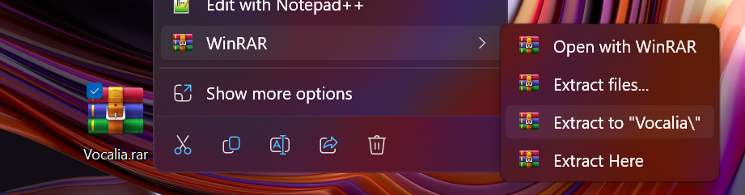

# Vocalia Voice Assistant Project

###### &emsp;&emsp;&emsp;&emsp;&emsp;&emsp;&emsp; — by [Mykyta Kyselov (TheMegistone4Ever)](https://github.com/TheMegistone4Ever).

## Table of Contents

1. [Deploying the Software](#1-deploying-the-software)
2. [Preparing to Work with the Software](#2-preparing-to-work-with-the-software)
    1. [System Requirements](#21-system-requirements)
    2. [Downloading the Application](#22-downloading-the-application)
    3. [Checking the Correct Operation](#23-checking-the-correct-operation)
3. [Running the Program](#3-running-the-program)
    1. [The main page of the voice assistant](#31-the-main-page-of-the-voice-assistant)
    2. [Voice assistant license page](#32-voice-assistant-license-page)
    3. [The page of voice assistant creators](#33-the-page-of-voice-assistant-creators)
    4. [Manual search](#34-manual-search)
    5. [Voice search](#35-voice-search)
    6. [Example of "search for" and "weather forecast" commands:](#36-example-of-search-for-and-weather-forecast-commands)
        1. [An example of using the "search for" command](#361-an-example-of-using-the-search-for-command)
        2. [Result of using the "search for" command](#362-result-of-using-the-search-for-command)
        3. [An example of using the "weather forecast" command and its result](#363-an-example-of-using-the-weather-forecast-command-and-its-result)
        4. [Result of using the "weather forecast" command](#364-result-of-using-the-weather-forecast-command)
4. [License](#4-license)

## 1 Deploying the Software

To deploy the voice application, follow these steps:

- Install JDK 21 or a later version from the [official website](https://www.oracle.com/cis/java/technologies/downloads).
- Create a new project in IntelliJ IDEA or another Java environment and clone the Vocalia repository:

  `git clone https://github.com/TheMegistone4Ever/Vocalia.git`

- Build the project using Maven:

  `mvn install`

- Create a JAR artifact in IntelliJ IDEA:
    1. Press `Cntrl+Alt+Shift+S` or go to `File -> Project Structure`.
    2. Go to the artifacts tab, click `➕`, select JAR, and choose "From modules with dependencies."
    3. Select the Vocalia module and the main class `com.nickmegistone.vocaliamaven.Vocalia`.
    4. Click "OK" and then "Apply."
    5. Build the project: `Build -> Build Artifacts -> Vocalia:jar -> Build`.

- Copy the full path of the JAR file from the out folder.

- Compile the JAR file from the root folder of the project:

  `"C:\Program Files\Java\jdk-<version>\bin\java.exe" -jar "ABSOLUTE PATH"`

- Use the voice assistant.

## Purpose of Development

The development aims to provide users with a convenient interface for interacting with technological devices through
voice commands. It seeks to facilitate the use of electronic devices, provide quick access to information and functions,
and improve daily life by automating tasks and intelligently answering questions.

## 2 Preparing to Work with the Software

### 2.1 System Requirements

**Minimum Hardware Configuration:**

- Processor type: Pentium 2 266 MHz;
- RAM: 2 GB;
- Internet connection: at least 2 megabits;
- JDK version: from 20.0.2.

**Recommended Hardware Configuration:**

- Processor type: AMD Ryzen 9 6900HS;
- RAM: 16 GB;
- Internet connection: at least 100 megabits;
- JDK version: from 21.0.1.

### 2.2 Downloading the Application

- Install JDK 21 or later from the [official website](https://www.oracle.com/cis/java/technologies/downloads/) if it's
  already not installed.
- Download the archive with the voice assistant from the latest release on
  the [Releases GitHub page](https://github.com/TheMegistone4Ever/Vocalia/releases).
- Unpack the archive using third-party utilities like WinRAR.

#### Unpacking the voice assistant on a computer

#### Launching the voice assistant

### 2.3 Checking the Correct Operation

After unzipping, check for a folder with the voice assistant ready to run. If successful, run the assistant using the "
run.vbs" file.

## 3 Running the Program

Launch the voice assistant, and You will be navigated to the main page automatically.

### 3.1 The main page of the voice assistant

Click on various menu buttons to explore contents, e.g., license and creators.

### 3.2 Voice assistant license page

### 3.3 The page of voice assistant creators

On the main panel, use manual or voice search, and try commands like:

- `play music`
- `tell me a joke`
- `weather forecast`
- `search for <SEARCH TEXT>`
- `translate <TRANSLATE TEXT>`
- `hey vocalia`
- `bye vocalia`

### 3.4 Manual search

### 3.5 Voice search

### 3.6 Example of "search for" and "weather forecast" commands:

#### 3.6.1 An example of using the "search for" command

#### 3.6.2 Result of using the "search for" command

#### 3.6.3 An example of using the "weather forecast" command and its result

#### 3.6.4 Result of using the "weather forecast" command

## 4 License

The project is licensed under the [CC BY-NC 4.0 License](LICENSE.md).
